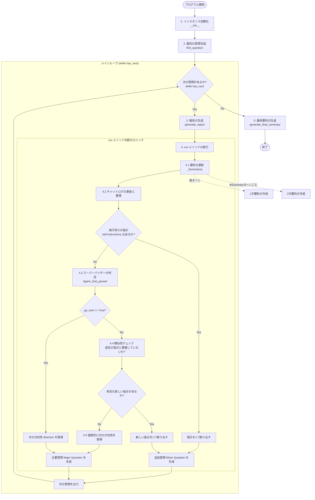

```mermaid
graph TD
    %% 全体の流れ
    Start([プログラム開始]) --> Init[1. インスタンス初期化<br/>__init__]
    Init --> FirstQ[2. 最初の質問生成<br/>first_question]
    FirstQ --> LoopStart{次の質問があるか?<br/>while has_next}

    subgraph "メインループ (while has_next)"
        LoopStart -- Yes --> GenReport[3. 報告の生成<br/>generate_report]
        GenReport --> RunProcess[4. run メソッドの実行]
        
        subgraph "run メソッド内部のロジック"
            RunProcess --> UpdateSum[4.1 要約の更新<br/>_Summarize]
            UpdateSum --> LogProcess[4.2 チャットログの更新と整理]
            LogProcess --> CheckInstr{実行待ちの指示<br/>self.instructions はあるか?}
            
            %% ケースA: 既存の指示がある場合
            CheckInstr -- Yes --> PopMinor[指示を1つ取り出す]
            PopMinor --> GenMinorQ[追加質問 Minor Question を生成]
            
            %% ケースB: 指示がない場合、スーパーバイザーが判定
            CheckInstr -- No --> Supervisor[4.3 スーパーバイザーの判定<br/>Agent_chat_parsed]
            Supervisor --> Judge{go_next == True?}
            
            
            %% スーパーバイザーが「まだ不足がある」と判断
            Judge -- No --> SimCheck[4.4 類似性チェック<br/>過去の指示と重複していないか?]
            SimCheck --> FilteredInstr{有効な新しい指示があるか?}
            
            FilteredInstr -- Yes --> PopNewMinor[新しい指示を1つ取り出す]
            PopNewMinor --> GenMinorQ
            
            FilteredInstr -- No --> ForceNext[4.5 強制的に次の方向性を取得]
            ForceNext --> GenMajorQ

            %% スーパーバイザーが「次に進め」と判断
            Judge -- Yes --> NextMajor[次の方向性 direction を取得]
            NextMajor --> GenMajorQ[主要質問 Major Question を生成]
            
        end

        GenMinorQ --> PrintNext[次の質問を出力]
        GenMajorQ --> PrintNext
        PrintNext --> LoopStart
    end

    LoopStart -- No --> FinalSummary[5. 最終要約の生成<br/>generate_final_summary]
    FinalSummary --> End([終了])

    %% 注釈的な役割
    UpdateSum -.-> |毎ターン| PrimSum[1次要約の作成]
    UpdateSum -.-> |thSummaryターンごと| SecSum[2次要約の作成]
```